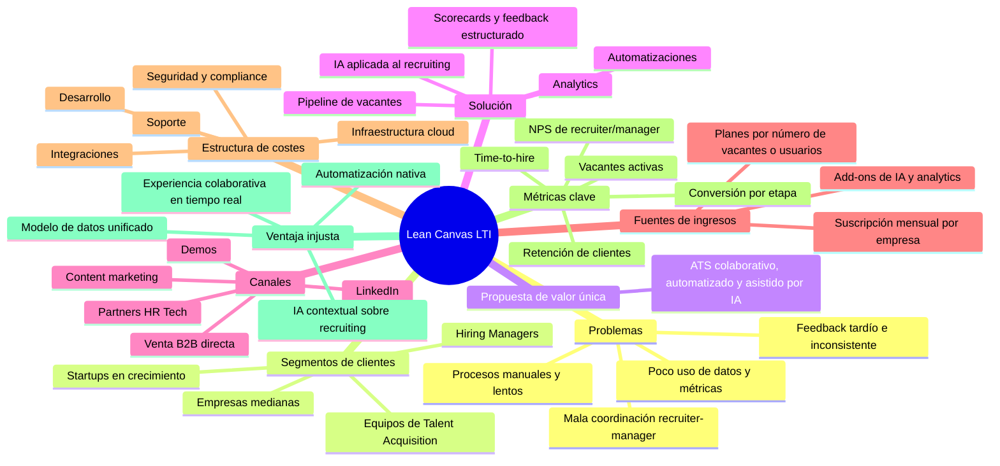
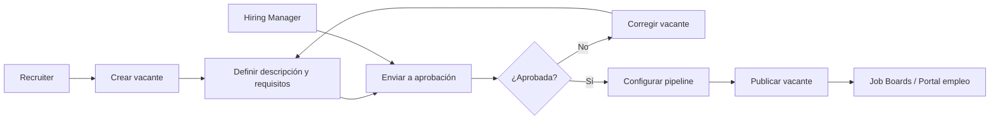
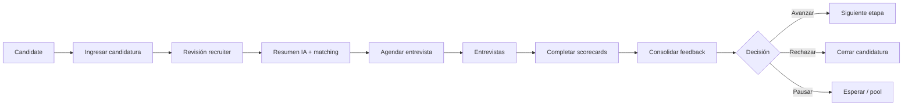
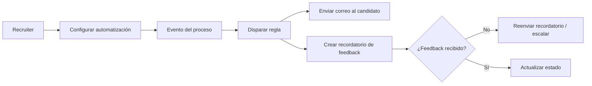
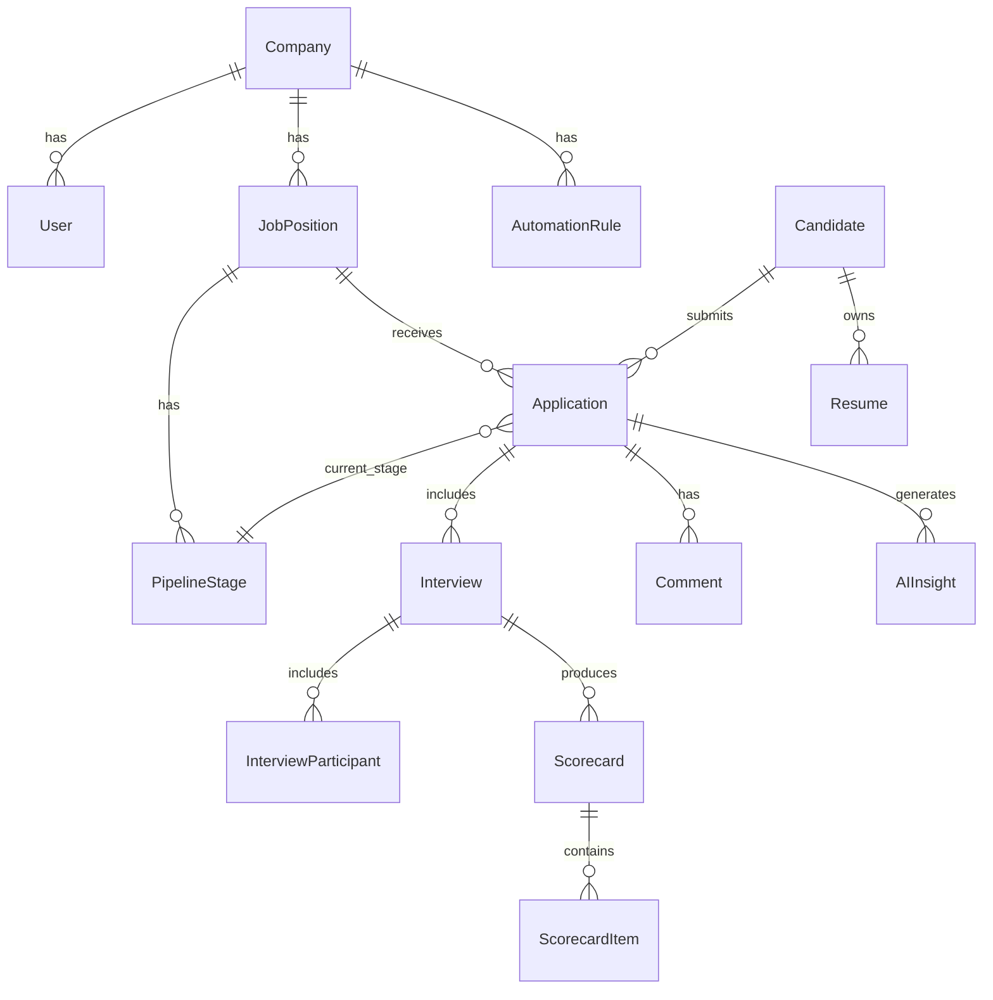
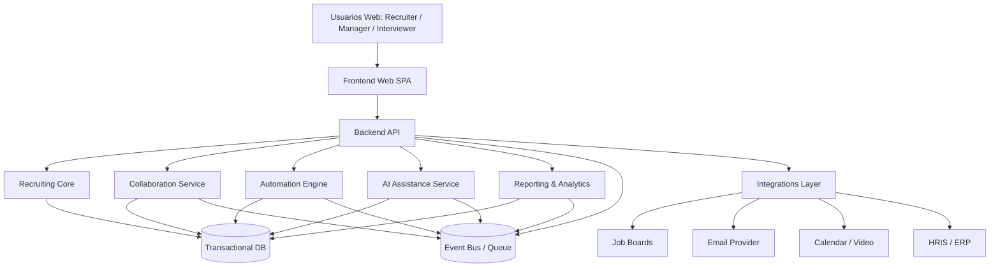
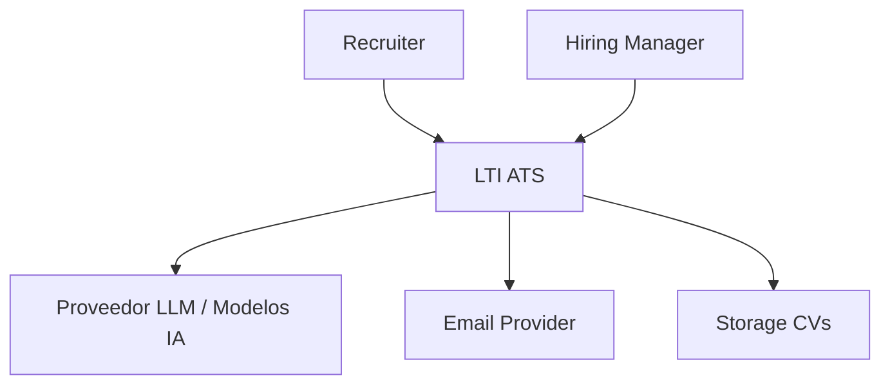
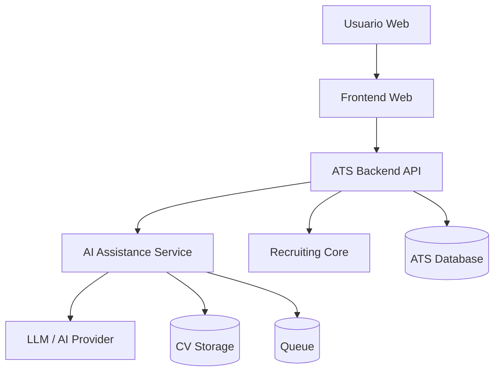
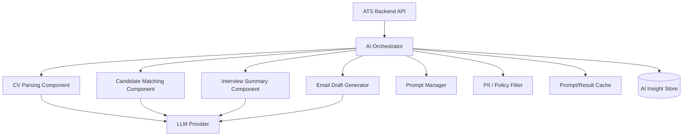

# LTI-ASP

## 1. Descripción breve del software LTI, valor añadido y ventajas competitivas

**LTI** es un **ATS (Applicant Tracking System)** de nueva generación orientado a equipos de Talent Acquisition y Hiring Managers que necesitan contratar más rápido, con mejor coordinación y mayor calidad de decisión.

La primera versión de LTI se enfoca en resolver cuatro problemas habituales del reclutamiento moderno:

1. **Demasiado trabajo manual** para RR. HH.  
2. **Mala coordinación** entre reclutadores y managers.  
3. **Procesos lentos e inconsistentes** entre vacantes y entrevistadores.  
4. **Poca explotación de datos** para priorizar candidatos y mejorar el proceso.

### Propuesta de valor
LTI combina en una sola plataforma:

- **Gestión end-to-end del pipeline de selección**
- **Colaboración en tiempo real**
- **Automatizaciones configurables**
- **Asistencia de IA en tareas de recruiting**
- **Analítica operacional y de calidad de contratación**

### Valor añadido frente a un ATS tradicional
A diferencia de un ATS clásico centrado solo en almacenar candidatos y moverlos por etapas, LTI nace con un enfoque de:

- **Structured hiring** desde el diseño del proceso
- **Decisiones más objetivas** mediante scorecards y feedback guiado
- **Automatización de tareas repetitivas**
- **Asistencia de IA contextual** sobre los datos del proceso
- **Mejor experiencia de colaboración** entre recruiter y hiring manager

### Ventajas competitivas
Las ventajas competitivas iniciales de LTI serían:

- **Motor de automatización nativo** para publicar vacantes, enrutar candidatos, recordar feedback y coordinar entrevistas.
- **Colaboración en tiempo real** con comentarios, menciones, estados y visibilidad compartida.
- **IA aplicada a tareas concretas**, no solo como “feature de marketing”: resumen de CV, matching con requisitos, borradores de mensajes, resumen de entrevistas y apoyo a priorización.
- **Modelo de datos unificado**, que permite trazabilidad completa desde la vacante hasta la contratación.
- **Analítica orientada a decisiones**, con métricas como time-to-hire, conversiones por etapa, cuellos de botella y desempeño de fuentes.

> Referencias del mercado actual: Greenhouse, Lever y Ashby.

---

## 2. Funciones principales del sistema

### 2.1 Gestión de vacantes y pipeline
Permite crear vacantes, definir etapas del proceso, responsables, criterios de evaluación y SLAs esperados.

**Funciones:**
- Crear y publicar vacantes
- Definir workflow por tipo de puesto
- Asignar recruiter y hiring manager
- Configurar etapas (screening, entrevista, prueba técnica, oferta, etc.)
- Visualizar pipeline Kanban/listado por etapa

### 2.2 Gestión de candidatos
Centraliza la información de cada candidato durante todo el proceso.

**Funciones:**
- Registro de candidatos desde distintos canales
- Perfil unificado con CV, experiencia, skills y notas
- Historial de interacciones
- Estado actual y trazabilidad del proceso
- Búsqueda y filtros avanzados

### 2.3 Colaboración en tiempo real
Facilita que recruiter, manager e interviewers trabajen sobre el mismo caso sin depender de cadenas de correo.

**Funciones:**
- Comentarios sobre candidatos
- Menciones a usuarios
- Feedback estructurado por entrevista
- Scorecards compartidos
- Notificaciones y alertas

### 2.4 Automatizaciones
Reduce tiempo operativo y errores de coordinación.

**Funciones:**
- Publicación automática en múltiples portales
- Cambio automático de estado por reglas
- Recordatorios de entrevistas y feedback pendiente
- Envío automático de correos de avance/rechazo
- Asignación automática de tareas

### 2.5 Asistencia de IA
Ayuda a acelerar tareas operativas y mejorar la consistencia.

**Funciones:**
- Resumen automático de CV
- Matching entre candidato y requisitos de la vacante
- Generación de preguntas sugeridas para entrevista
- Resumen de feedback disperso
- Borradores de correos a candidatos
- Priorización asistida de perfiles

### 2.6 Reporting y analítica
Entrega visibilidad del proceso y soporte para mejora continua.

**Funciones:**
- Time-to-fill / time-to-hire
- Conversión por etapa
- Funnel por fuente de candidatos
- Tiempo promedio de feedback
- Tasa de aceptación de oferta
- Cuellos de botella por vacante o área

---

## 3. Lean Canvas

### Explicación breve del modelo de negocio
LTI operaría como SaaS B2B con una suscripción mensual o anual. El producto base cubriría ATS + colaboración + automatizaciones, mientras que los módulos avanzados de IA, analytics premium e integraciones enterprise podrían monetizarse como add-ons.

---

## 4. Casos de uso principales

## Caso de uso 1: Crear y publicar una vacante

### Objetivo
Permitir que RR. HH. y el Hiring Manager creen una vacante estandarizada y la publiquen en canales de atracción.

### Actores
- Recruiter
- Hiring Manager
- Sistema LTI
- Job Boards externos

### Flujo principal
1. El recruiter crea una nueva vacante.
2. Define título, área, seniority, descripción y requisitos.
3. El hiring manager revisa y aprueba la vacante.
4. Se configura el pipeline de selección.
5. El sistema publica la vacante en canales internos y externos.
6. La vacante queda activa para recepción de candidatos.

### Reglas relevantes
- No puede publicarse sin aprobación del hiring manager.
- Toda vacante debe tener pipeline y criterios mínimos de evaluación.

### Diagrama asociado

---

## Caso de uso 2: Evaluar y avanzar un candidato

### Objetivo
Gestionar la evaluación de un candidato de forma colaborativa y estructurada hasta decidir su avance o descarte.

### Actores
- Recruiter
- Hiring Manager
- Interviewer
- Sistema LTI

### Flujo principal
1. El candidato ingresa al sistema.
2. El recruiter revisa el perfil.
3. El sistema genera resumen y matching por IA.
4. Se agenda entrevista.
5. Los entrevistadores completan scorecards.
6. El hiring manager revisa feedback consolidado.
7. Se decide avanzar, pausar o rechazar al candidato.

### Reglas relevantes
- El feedback debe registrarse antes de la decisión final.
- La decisión debe quedar trazable junto a comentarios y scorecards.

### Diagrama asociado

---

## Caso de uso 3: Automatizar comunicaciones y seguimiento

### Objetivo
Reducir tareas operativas automatizando comunicaciones, recordatorios y actualizaciones del pipeline.

### Actores
- Recruiter
- Sistema LTI
- Candidato
- Hiring Manager

### Flujo principal
1. El recruiter configura una regla de automatización.
2. Se detecta un evento (por ejemplo, candidato pasa a entrevista).
3. El sistema envía correo al candidato.
4. El sistema crea recordatorio para feedback del interviewer.
5. Si no hay respuesta, el sistema reitera o escala la alerta.
6. El recruiter monitorea el resultado.

### Reglas relevantes
- Toda automatización debe quedar auditable.
- Los usuarios deben poder activar o desactivar reglas.

### Diagrama asociado

---

## 5. Modelo de datos

A continuación, se presenta un modelo de datos lógico inicial.

### 5.1 Entidades, atributos y tipos

#### Company
- id: UUID
- name: string
- industry: string
- size_range: string
- created_at: datetime

#### User
- id: UUID
- company_id: UUID
- full_name: string
- email: string
- role: enum(recruiter, hiring_manager, interviewer, admin)
- status: enum(active, inactive)
- created_at: datetime

#### JobPosition
- id: UUID
- company_id: UUID
- hiring_manager_id: UUID
- recruiter_id: UUID
- title: string
- department: string
- location: string
- employment_type: enum(full_time, part_time, contract, internship)
- status: enum(draft, pending_approval, open, paused, closed)
- description: text
- requirements: text
- created_at: datetime
- published_at: datetime

#### PipelineStage
- id: UUID
- job_position_id: UUID
- name: string
- stage_order: integer
- stage_type: enum(screening, interview, assessment, offer, hired, rejected)
- sla_hours: integer

#### Candidate
- id: UUID
- full_name: string
- email: string
- phone: string
- linkedin_url: string
- current_title: string
- location: string
- source: string
- created_at: datetime

#### Application
- id: UUID
- candidate_id: UUID
- job_position_id: UUID
- current_stage_id: UUID
- status: enum(active, rejected, withdrawn, hired, on_hold)
- applied_at: datetime
- last_activity_at: datetime

#### Resume
- id: UUID
- candidate_id: UUID
- file_url: string
- parsed_text: text
- uploaded_at: datetime

#### Interview
- id: UUID
- application_id: UUID
- stage_id: UUID
- scheduled_at: datetime
- duration_minutes: integer
- interview_type: enum(phone, video, onsite, technical)
- status: enum(scheduled, completed, cancelled)

#### InterviewParticipant
- id: UUID
- interview_id: UUID
- user_id: UUID
- participant_role: enum(interviewer, observer)

#### Scorecard
- id: UUID
- interview_id: UUID
- user_id: UUID
- recommendation: enum(strong_yes, yes, no, strong_no)
- overall_score: integer
- submitted_at: datetime

#### ScorecardItem
- id: UUID
- scorecard_id: UUID
- competency_name: string
- score: integer
- comment: text

#### Comment
- id: UUID
- application_id: UUID
- user_id: UUID
- message: text
- created_at: datetime

#### AutomationRule
- id: UUID
- company_id: UUID
- name: string
- trigger_event: string
- condition_json: json
- action_json: json
- is_active: boolean
- created_at: datetime

#### Notification
- id: UUID
- user_id: UUID
- type: string
- message: string
- is_read: boolean
- created_at: datetime

#### AIInsight
- id: UUID
- application_id: UUID
- insight_type: enum(cv_summary, candidate_match, interview_summary, email_draft)
- content: text
- confidence_score: decimal
- created_at: datetime

### 5.2 Relaciones principales
- Una **Company** tiene muchos **User**
- Una **Company** tiene muchas **JobPosition**
- Una **JobPosition** tiene muchas **PipelineStage**
- Un **Candidate** puede tener muchas **Application**
- Una **JobPosition** puede tener muchas **Application**
- Una **Application** pertenece a una etapa actual (**PipelineStage**)
- Un **Candidate** puede tener muchos **Resume**
- Una **Application** puede tener muchas **Interview**
- Una **Interview** puede tener muchos **InterviewParticipant**
- Una **Interview** puede tener muchos **Scorecard**
- Un **Scorecard** puede tener muchos **ScorecardItem**
- Una **Application** puede tener muchos **Comment**
- Una **Company** puede tener muchas **AutomationRule**
- Una **Application** puede tener muchos **AIInsight**

### 5.3 Diagrama del modelo de datos

---

## 6. Diseño del sistema a alto nivel

## 6.1 Explicación

Se propone una arquitectura modular basada en servicios lógicos separados, aunque inicialmente podrían implementarse como un **modular monolith** para acelerar la primera versión y reducir complejidad operacional.

### Módulos principales
1. **Frontend Web**
   - Interfaz para recruiters, managers e interviewers.
   - Gestión de vacantes, candidatos, entrevistas, feedback y dashboards.

2. **API Backend**
   - Expone servicios para operaciones del ATS.
   - Centraliza lógica de negocio, permisos y validaciones.

3. **Recruiting Core**
   - Gestiona vacantes, aplicaciones, pipeline y decisiones.

4. **Collaboration Service**
   - Comentarios, menciones, notificaciones y actividad en tiempo real.

5. **Automation Engine**
   - Ejecuta reglas por eventos del sistema.

6. **AI Assistance Service**
   - Procesa CV, genera resúmenes, matching y borradores.

7. **Reporting & Analytics**
   - Consolida datos operativos para métricas y dashboards.

8. **Integrations Layer**
   - Portales de empleo, correo, calendario, videollamadas y HRIS.

9. **Base de datos transaccional**
   - Persistencia principal del negocio.

10. **Event Bus / Queue**
   - Manejo asíncrono de eventos como notificaciones, automatizaciones y tareas de IA.

### Decisiones de diseño
- **Frontend SPA** para experiencia fluida.
- **Backend API REST** para simplicidad inicial.
- **Procesos asíncronos** para IA, emails y automatizaciones.
- **Arquitectura orientada a eventos** para desacoplar procesos.
- **Auditoría y trazabilidad** como capacidades nativas.
- **RBAC** para diferenciar recruiter, manager, interviewer y admin.

### Calidad esperada del sistema
- Escalabilidad moderada desde MVP
- Trazabilidad total del proceso
- Seguridad y control de accesos
- Observabilidad para operaciones y soporte
- Capacidad de evolucionar luego a microservicios si el negocio crece

### Diagrama de alto nivel

---

## 7. Diagrama C4

Para profundizar, se elige el componente **AI Assistance Service**, ya que representa una de las principales ventajas competitivas de LTI.

## 7.1 C4 - Contexto (System Context)

## 7.2 C4 - Contenedores (Container Diagram)

## 7.3 C4 - Componentes del AI Assistance Service

## 7.4 Explicación del componente elegido
El **AI Assistance Service** actúa como un servicio especializado que transforma datos del ATS en apoyo práctico para el equipo de selección.

### Responsabilidades
- Analizar CVs y generar resúmenes
- Calcular matching candidato-vacante
- Consolidar feedback disperso en resúmenes utilizables
- Generar borradores de comunicación
- Guardar insights generados para auditoría y reutilización

### Razones para elegir este componente
- Es un diferenciador del producto.
- Permite acelerar el trabajo del recruiter.
- Tiene impacto directo en eficiencia y experiencia.
- Obliga a diseñar controles de privacidad, auditabilidad y calidad de resultados.

---

## 8. Recomendaciones iniciales de producto

Para que la primera versión de LTI tenga foco y sea viable, se recomienda priorizar este alcance MVP:

### MVP recomendado
- Gestión de vacantes
- Pipeline configurable
- Gestión de candidatos y aplicaciones
- Entrevistas y scorecards
- Comentarios y colaboración
- Automatizaciones básicas
- IA para resumen de CV y borradores de correo
- Dashboard operativo básico

### Funcionalidades posteriores
- Talent CRM avanzado
- Marketplace de integraciones
- Matching predictivo más sofisticado
- Reportería avanzada con benchmarking
- Portal de candidatos y employer branding
- Automatización low-code para usuarios no técnicos

---

## 9. Conclusión

LTI puede posicionarse como un ATS moderno si desde su primera versión combina tres pilares:

1. **Eficiencia operativa** para HR  
2. **Colaboración estructurada** entre recruiter y hiring manager  
3. **IA y automatización aplicadas a tareas concretas**  

La propuesta inicial presentada cubre negocio, casos de uso, datos y arquitectura, dejando una base suficiente para que diseño, desarrollo y producto puedan comenzar una primera iteración del sistema con una visión compartida.

---

## 10. Referencias

- https://www.greenhouse.com/
- https://www.lever.co/
- https://www.ashbyhq.com/
